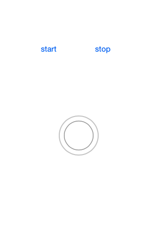
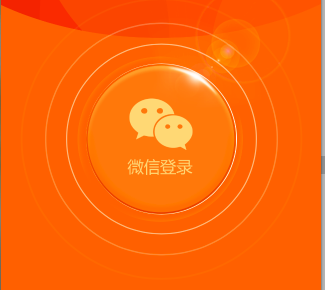

# XXBRippleView
水波纹效果
支持xib和纯代码

- (void)setupRippleView
{
    self.rippleView.minRadius = self.loginButton.frame.size.width * 0.5;
    self.rippleView.maxRadius = self.loginButton.frame.size.width * 0.5 + 50;
    self.rippleView.rippleColor = [UIColor whiteColor];
}

