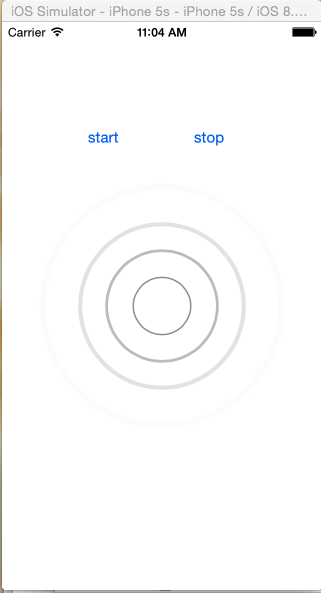

# XXBRippleView
水波纹效果
支持xib和纯代码

默认圆圈显示在view的中间
通过简单的设置就可以实现效果
  self.rippleView.minRadius = self.loginButton.frame.size.width * 0.5;
  self.rippleView.maxRadius = self.loginButton.frame.size.width * 0.5 + 50;
  self.rippleView.rippleColor = [UIColor whiteColor];

